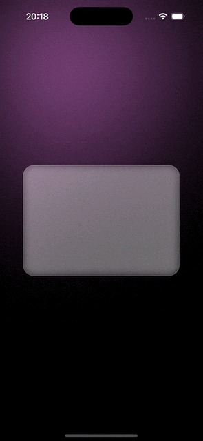

# React Native + Skia Learning Project

This repository contains my journey learning React Native with Skia, exploring advanced animations and graphics capabilities.

## About

This project serves as a learning playground where I experiment with [@shopify/react-native-skia](https://github.com/Shopify/react-native-skia), a library that brings high-performance 2D graphics to React Native.

## Inspiration

This project was inspired by Enzo's excellent tutorial on React Native Skia animations. You can check out his tutorial here:
[React Native Skia Tutorial by Enzo](https://www.youtube.com/watch?v=SveA2QjmEzM)

## Demo

